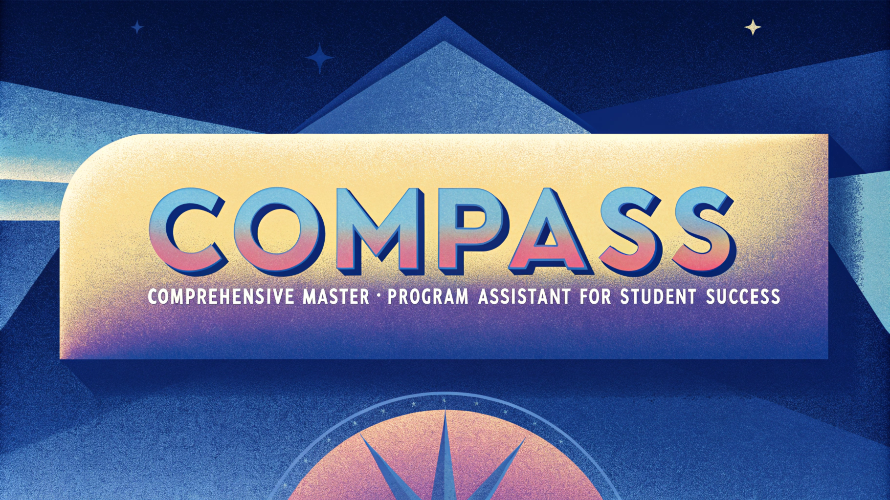

# COMPASS - University Recommendation System 🎓

COMPASS is an AI-powered university guidance system that helps international students find and track university programs, living expenses, and career opportunities in the United States. The system provides personalized recommendations based on user preferences and maintains an interactive chat interface for queries about universities, costs, weather, and job prospects.



## Features 🌟

- **Personalized University Recommendations**: Get customized university suggestions based on:
  - Field of study
  - Budget range
  - Preferred locations
  - Weather preferences

- **Interactive Chat Interface**: Ask questions about:
  - University programs and requirements
  - Living expenses in different states
  - Weather conditions
  - Job market trends

- **Application Tracking**:
  - Download application tracker template
  - Track application status
  - Manage document requirements
  - Monitor deadlines

- **Resource Generation**:
  - Application checklist in DOCX format
  - CSV template for application tracking
  - Comprehensive university information

## Technical Stack 💻

- **Frontend**: Streamlit
- **Database**: ChromaDB with OpenAI embeddings
- **APIs**:
  - OpenAI GPT-4
  - OpenWeather API
- **Data Processing**: Pandas, Python-docx
- **Additional Libraries**: Requests, Logging

## Installation 🔧

1. Clone the repository:
```bash
git clone https://github.com/gudashashank/compass-assistant.git
cd compass
```

2. Install required packages:
```bash
pip install -r requirements.txt
```

3. Set up environment variables in a `secrets.toml` file:
```toml
open-key = "your-openai-api-key"
open-weather = "your-openweather-api-key"
```

## Usage 🚀

1. Start the application:
```bash
streamlit run app.py
```

2. Access the web interface at `http://localhost:8501`

3. Log in with your name to begin

4. Set your preferences for personalized recommendations

5. Use the chat interface to:
- Get university recommendations
- Ask questions about programs
- Track applications
- Generate resources

## Data Structure 📊

The system uses three main ChromaDB collections:
- `university_info`: University program details and requirements
- `living_expenses`: Cost of living data by state
- `employment_projections`: Job market trends and statistics

## Features in Detail 🔍

### User Management
- Personal preferences storage
- Chat history tracking
- Application status monitoring

### Recommendation Engine
- Uses OpenAI's GPT-4 for natural language processing
- Combines multiple data sources for comprehensive insights
- Provides context-aware responses

### Weather Integration
- Real-time weather data for university locations
- Temperature and conditions updates
- Regional climate information

## Contributing 🤝

1. Fork the repository
2. Create your feature branch: `git checkout -b feature/AmazingFeature`
3. Commit your changes: `git commit -m 'Add some AmazingFeature'`
4. Push to the branch: `git push origin feature/AmazingFeature`
5. Open a pull request

## Project Structure 📁

```
compass/
├── app.py              # Main application file
├── data/              # Data directory
│   ├── University_Data.docx
│   ├── Avg_Living_Expenses.csv
│   ├── Employment_Projections.csv
│   ├── compass_logo.png
│   └── compass_logo_wide.png
├── chroma_db/         # ChromaDB storage
├── requirements.txt   # Package dependencies
└── .streamlit/       # Streamlit configuration
    └── secrets.toml  # API keys and secrets
```

## License 📄

This project is licensed under Apache License.

📝 **Note:**  
This app will remain available until my current API credits are exhausted. At this time, I am unable to provide an option for users to connect their own API to the app. I apologize for the inconvenience and appreciate your understanding.

**Made with 💙 by [Shashank Guda](https://shashankguda.me)**
